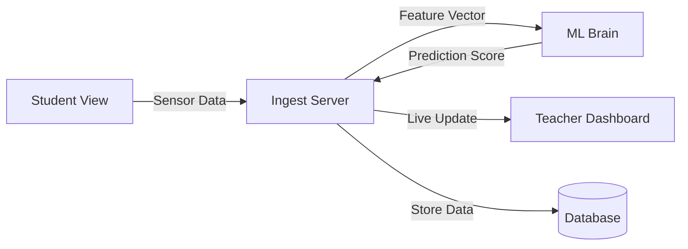
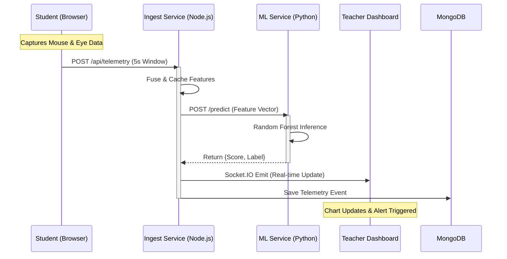
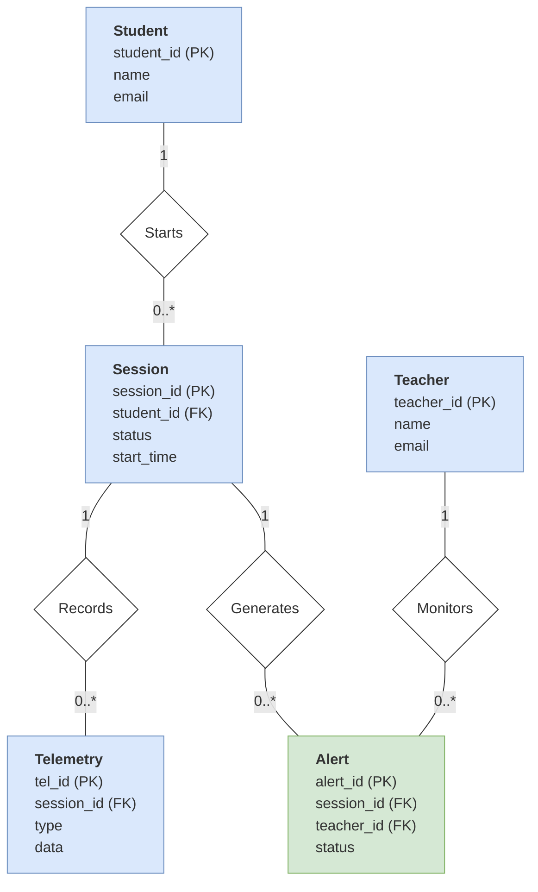
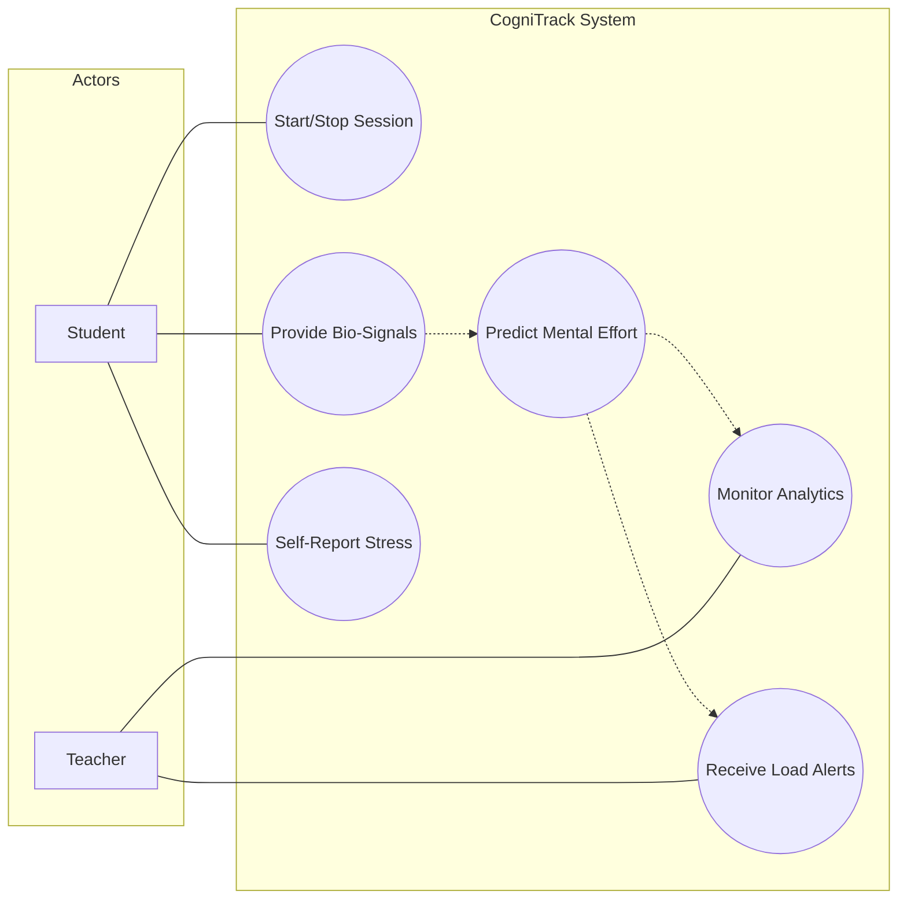

# COGNITRACK AI: SYSTEM WORKFLOW

This document encapsulates the structural, behavioral, and data logic of the project through visual diagrams and detailed explanations.

## 1. Simplified Workflow Diagram
This diagram shows the general movement of data through the microservices.



---

## 2. Technical Sequence Diagram
This diagram shows the **time-ordered interaction** between different system components during a single estimation cycle.



---

## 3. Entity-Relationship (ER) Diagram
This diagram illustrates the data structure of the **Adaptive Cognitive Load Estimator**, styled for maximum clarity.



---

## 4. Use Case Diagram
This diagram follows formal UML standards to show the relationships between the Actors (Student, Teacher, AI System) and the core functional requirements of the platform.



---

## 5. Activity Diagram
This diagram shows the dynamic flow of activities within the system, from the initial sensor capture to the final teacher alert.

```mermaid
flowchart TD
    Start([Start Session]) --> Init[Initialize Multi-sensor Capture]
    Init --> Capture{Capture Window}
    
    subgraph Parallel Capture
        direction LR
        Mouse[Mouse Tracking]
        Eye[Webcam AI Tracking]
    end
    
    Capture --> Parallel Capture
    Parallel Capture --> Aggregate[5s Feature Aggregation]
    
    Aggregate --> Send[Transmit to Ingest Service]
    Send --> Predict[Random Forest Inference]
    
    Predict --> Logic{Score > 0.5?}
    Logic -->|Yes| Alert[Trigger Teacher Alert]
    Logic -->|No| Dashboard[Update Live Charts]
    
    Alert --> Dashboard
     Dashboard --> End{Session Ended?}
    
    End -->|No| Capture
    End -->|Yes| Final([Stop Tracking])
```

---

## 6. Step-by-Step Logic
1.  **Capture**: Student's mouse and eye data are collected in the browser via `MouseLogger.jsx` and `WebcamTracker.jsx`.
2.  **Processing**: Data is sent to the Ingest Server for cleaning, synchronization, and feature fusion.
3.  **Analysis**: The "ML Brain" (Random Forest) calculates the load score based on the multimodal vector.
4.  **Feedback**: The score is broadcast to the Teacher Dashboard in real-time via WebSockets (Socket.IO).
5.  **History**: All data is saved in MongoDB for long-term reporting and analysis.
